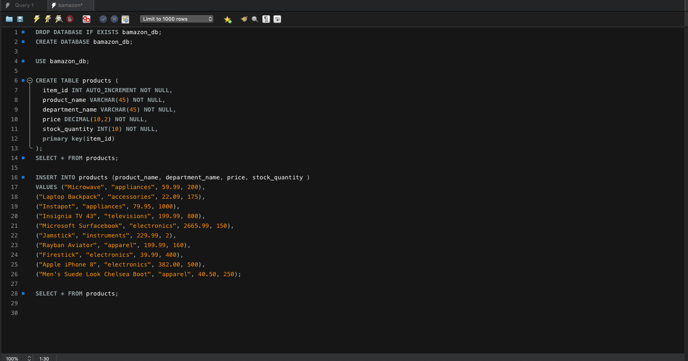
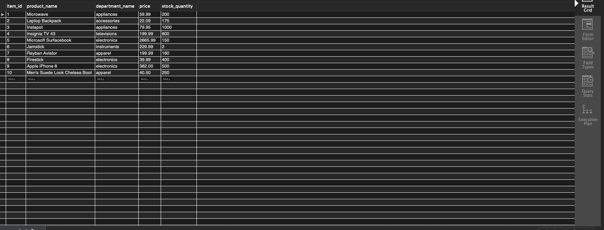
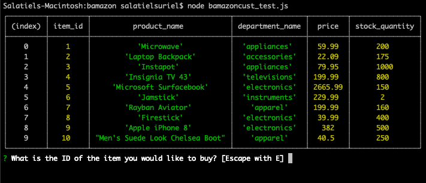
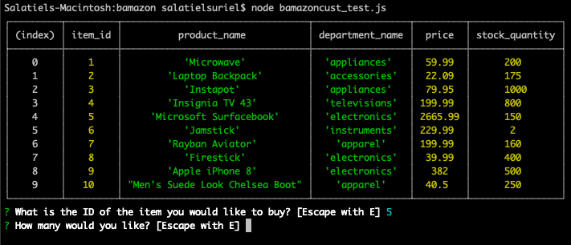
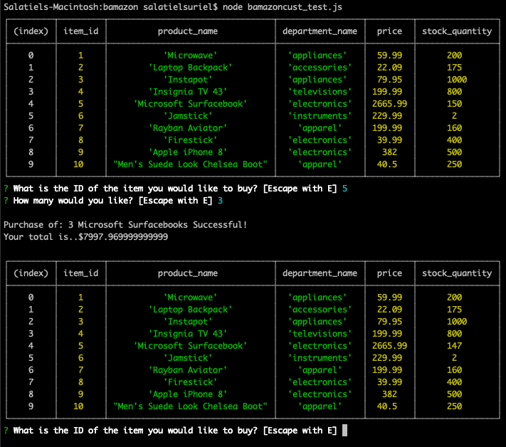
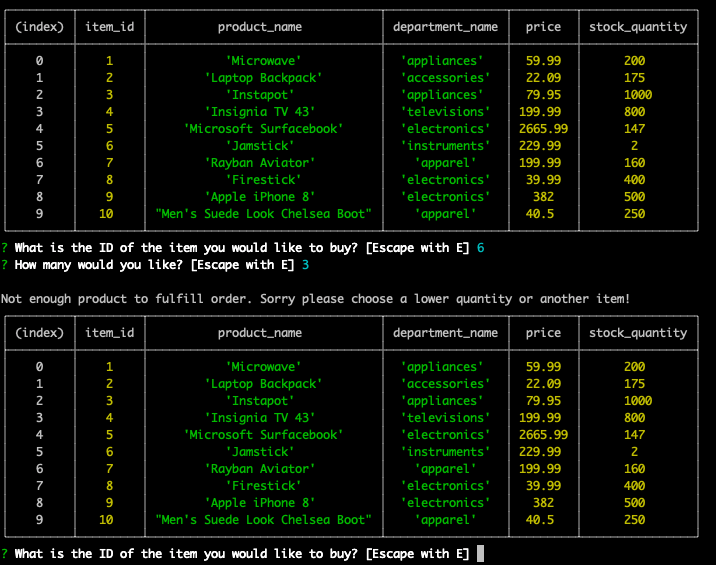
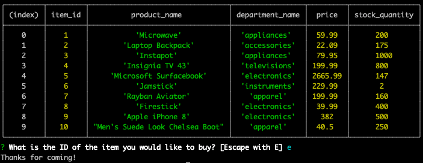
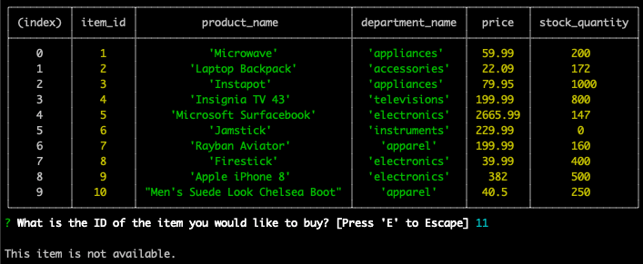

# Bamazon

https://surielsa.github.io/Sals-eShop/

By: Sal Suriel

# Bamazon Customer

In this activity, I created an Amazon-like storefront with the MySQL skills I learned this unit. 
The app will take in orders from customers and deplete stock from the store's inventory. 

I created the database below and added the values to the table manually. 

# Bamazon MySQL Database

# Bamazon MySql Table

# How the App Works

Then I created the js file that would use the database table information to mimic the customer purchases on this e-commerce like app. Below is the process as of this app worked using NodeJs.

# Video of the app running some basic purchases.

https://drive.google.com/open?id=1Xaq-oyRigLfuITe_GuwEncPaqN0XjnPu

